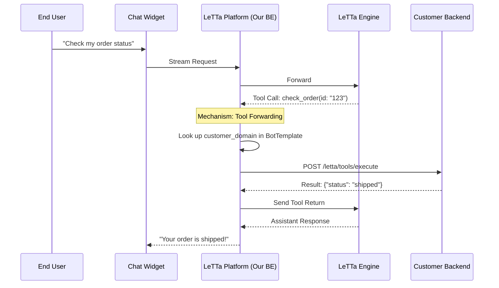

# Tool Approval - Overview

This document defines the implementation plan for user approval workflow and bidirectional tool forwarding.

---

## 1. Overview

Implement a secure workflow where Letta agents must request user approval before executing sensitive tools. Additionally, implement the **Bidirectional Forwarding** mechanism to allow the platform to request tool execution from a customer's private backend using a registered domain.

**Status**: 🟡 **IN PROGRESS** (Tool Forwarding Implemented, Approval UI Pending)

---

## 2. Business Goals

1. **Security**: Prevent unauthorized tool executions
2. **Transparency**: Users see exactly what the agent wants to do
3. **Connectivity**: Enable RAG and tool execution on private customer data
4. **Audit Trail**: Track all approval decisions

---

## 3. Technical Goals

### Human-in-the-Loop (HITL) Detection
- Intercept `approval_request_message` in the Letta stream
- Halt current stream and notify the Chat Widget
- Capture new `run_id` upon approval and resume stream

### Bidirectional Forwarding
- Agent decides a tool (e.g., `check_order`) is needed
- Platform detects this is an **External Tool**
- Platform fetches `customer_domain` from `BotTemplate`
- Platform forwards the call: `POST https://{customer_domain}/letta/tools/execute`
- Customer Backend returns result → Platform forwards back to Letta Engine

---

## 4. Sequence Diagram

---

## 5. Scope

### In Scope
- Tool call detection in stream
- `customer_domain` lookup and routing
- HMAC SHA-256 signature for security
- Multi-org isolation enforcement
- Tool return to Letta Engine

### Out of Scope (Pending)
- `approval_request_message` detection (manual approval workflow)
- Approval UI integration (frontend)
- Approval state persistence (database table)

---

## 6. Dependencies

**Infrastructure**:
- Existing `BotTemplate` model with `customer_domain` field
- Letta Engine streaming API
- HMAC SHA-256 signing library

**Previous Features**:
- Custom DB Integration (required)
- Streaming API (required)

---

## 7. Acceptance Criteria

### Completed ✅
- [x] Detects `tool_call` event in stream
- [x] Correctly look up and use `customer_domain` for routing
- [x] Forwarding request includes HMAC SHA-256 signature
- [x] Multi-org isolation is strictly enforced
- [x] Send tool return back to Letta Engine

### Pending 🔴
- [ ] Detects `approval_request_message` in stream
- [ ] Captures new `run_id` upon approval and resumes stream
- [ ] Approval UI integration
- [ ] Approval state persistence

---

## Related

- [01-database-schema.md](./01-database-schema.md) - Approval state table
- [02-api-design.md](./02-api-design.md) - Approval endpoints
- [03-implementation.md](./03-implementation.md) - Tool forwarding logic
- [04-testing.md](./04-testing.md) - Test coverage

- [08-tool-approval-pattern.md](../../../docs/letta/08-tool-approval-pattern.md) - Tool approval reference
