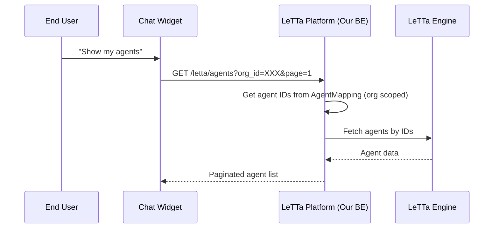

# Agent Search - Overview

This document defines the implementation plan for agent search and listing functionality.

---

## 1. Overview

Implement search and listing functionality for Agents within an organization. Users can find agents by name, description, and filter by creation date.

**Status**: 🟡 **PLANNED**

---

## 2. Business Goals

1. **Discoverability**: Users can easily find agents they created
2. **Organization Scope**: Each organization sees only their own agents
3. **Performance**: Paginated results to handle large agent lists
4. **Flexibility**: Simple keyword search + date filters

---

## 3. Technical Goals

### Query Letta API
- Agents are stored in **Letta Engine**, not our DB
- Use Letta API endpoint: `GET /api/agents`
- Cache results locally if needed (future)

### Organization Isolation
- Filter results by `organization_id` using `AgentMapping` table
- Never expose agents from other organizations

### Pagination
- Use Kaminari gem (already in project)
- Default: 20 per page
- Max: 100 per page

---

## 4. User Flow

```
User → Dashboard → Agent List
                ↓
         [Search Input] [Filter by Date]
                ↓
         Paginated Agent Cards
                ↓
         Click Agent → View Details
```

---

## 5. Sequence Diagram



---

## 6. Scope

### In Scope
- GET `/letta/agents` with pagination
- Search by `name` (partial match, case-insensitive)
- Search by `description` (partial match, case-insensitive)
- Filter by `created_at` date range
- GET `/letta/agents/:id` for details
- Multi-org isolation

### Out of Scope
- Full-text search (use PostgreSQL full-text or ElasticSearch later)
- Agent creation/update/delete (already implemented)
- Agent analytics/stats
- Cross-organization search (admin only - future)

---

## 7. Dependencies

| Dependency | Type | Status |
|------------|------|--------|
| Letta API: List Agents endpoint | External | 🔴 Need to verify |
| Kaminari gem | Internal | ✅ Installed |
| AgentMapping table | Internal | ✅ Exists |
| ApplicationController | Internal | ✅ Exists |

---

## 8. Acceptance Criteria

### Must Have
- [ ] GET `/letta/agents` returns paginated list
- [ ] Results scoped to `organization_id`
- [ ] Search by `name` (partial match, case-insensitive)
- [ ] Search by `description` (partial match, case-insensitive)
- [ ] Filter by `created_at` date range
- [ ] Pagination: default 20, max 100 per page
- [ ] GET `/letta/agents/:id` returns single agent details
- [ ] 404 if agent not found or not in organization

### Nice to Have
- [ ] Sort by name, created_at
- [ ] Filter by tool types
- [ ] Response caching (Redis)

---

## Related

- [01-database-schema.md](./01-database-schema.md) - No DB changes needed
- [02-api-design.md](./02-api-design.md) - Search endpoints
- [03-implementation.md](./03-implementation.md) - Search logic
- [04-testing.md](./04-testing.md) - Test coverage
