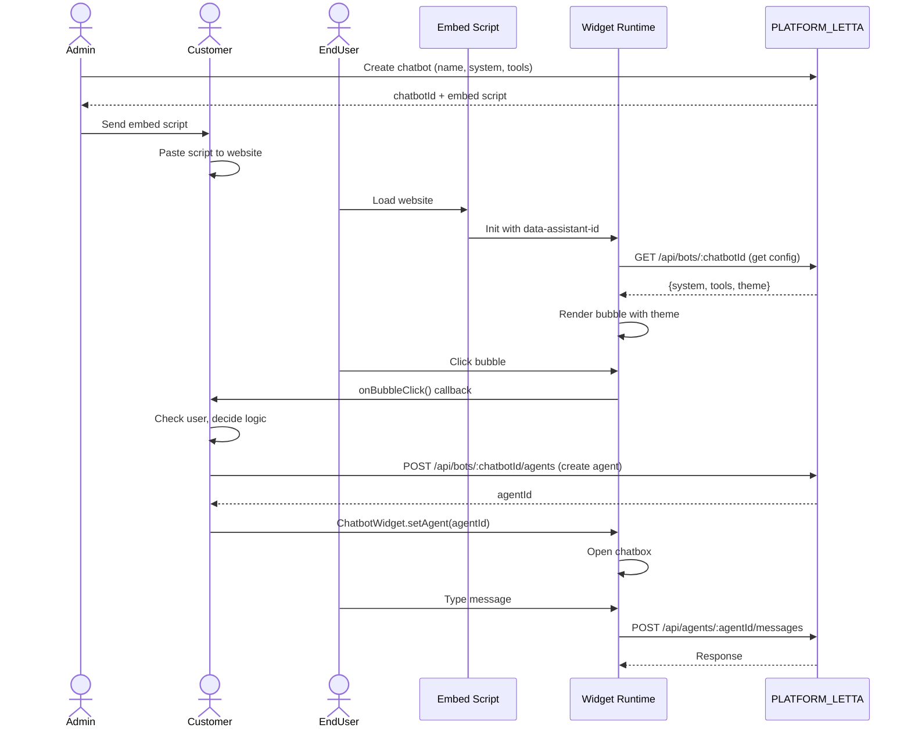

# Overview: FE Widget & BE Server Integration Model

## Kiến trúc hệ thống

Mô hình này tách biệt hoàn toàn **UI/Widget (FE)** và **AI Logic (BE)** thành 2 project riêng biệt.

### Project 1: PLATFORM_LETTA (BE)
- Server Node.js + Express.js + Letta AI Client.
- **Đã setup sẵn**: Agent creation, chat, memory, RAG, tool calling.
- **API Base**: `http://localhost:3000/api/letta`.
- **Tuyệt đối không** render UI.

### Project 2: Embed Widget (FE)
- **Công nghệ**: Vanilla JavaScript (không dùng framework).
- **Build tool**: Webpack hoặc Rollup.
- **Output**: 1 file `embed.js` để embed.
- **Tự động init**: Đọc `data-assistant-id` từ script tag và chạy.
- **Nhiệm vụ**:
  - Render UI chatbox bubble.
  - Expose API: `ChatbotWidget.setAgent()`, `ChatbotWidget.startChat()`.
  - Handle chat flow và tool calls.

---

## Concept Quan Trọng

### chatbotId (Bot Template)
- **Mục đích**: Phân biệt PROJECT/CONFIG.
- **Được set bởi**: Admin khi tạo chatbot.
- **Quyết định**: System prompt, tools, theme cho chatbot đó.
- **Ví dụ**:
  - `chatbot_ecommerce_A` → "You are a shopping assistant" + tool: search_products
  - `chatbot_support_B` → "You are a support agent" + tool: check_ticket

### agentId (Thread/Conversation)
- **Mục đích**: Phân biệt THREAD/CONVERSATION.
- **Được set bởi**: Customer's website (tùy logic của họ).
- **Quyết định**: Conversation history, memory.
- **Ví dụ**:
  - User A → `agent_001` (thread riêng)
  - User B → `agent_002` (thread riêng)
  - User A click "New chat" → `agent_003` (thread mới)

---

## Workflow Tổng Quát

### Giai đoạn 1: Admin Setup (One-time)
```
Admin → Create Chatbot
     → Input: name, system prompt, tools, theme
     → Platform generates: chatbotId + embed script
     → Output:
        <script src="https://uimgpt.com/embed.js"
                data-assistant-id="chatbot-123"></script>
```

**chatbotId đã có SẴN trong script!**

---

### Giai đoạn 2: Customer Integration (Paste Script)

Customer **chỉ cần paste script** vào website:

```html
<!-- Customer's website -->
<!DOCTYPE html>
<html>
<head>...</head>
<body>
  <h1>My Website</h1>

  <!-- Paste embed script (chatbotId đã có sẵn) -->
  <script src="https://uimgpt.com/embed.js"
          data-assistant-id="chatbot-123"></script>
</body>
</html>
```

**Widget tự động**:
1. Load script
2. Đọc `data-assistant-id` → lấy chatbotId
3. Render bubble icon
4. CHƯA tạo agent (chờ user click)

---

### Giai đoạn 3: Runtime (Customer Decide Logic)

**Widget expose API** để customer tùy chỉnh:

#### Option A: Customer tự tạo agent trước
```html
<script src="embed.js" data-assistant-id="chatbot-123"></script>
<script>
  // Customer's logic: Check user logged in
  const user = getCurrentUser();

  if (user) {
    // Get agentId from DB
    const agentId = await myBackend.getAgentId(user.id);

    // Set agent cho widget
    ChatbotWidget.setAgent(agentId);
  } else {
    // Guest: tạo agent mới khi click
    ChatbotWidget.onBubbleClick(() => {
      const agentId = await ChatbotWidget.createAgent();
      // Optional: Save to session
      sessionStorage.setItem('guestAgentId', agentId);
    });
  }
</script>
```

---

#### Option B: Widget tự tạo agent khi user click
```html
<script src="embed.js" data-assistant-id="chatbot-123"></script>
<script>
  // Widget tự động tạo agent khi user click bubble lần đầu
  // Customer không cần làm gì
</script>
```

---

#### Option C: Check login trước khi cho chat
```html
<script src="embed.js" data-assistant-id="chatbot-123"></script>
<script>
  ChatbotWidget.onBubbleClick(() => {
    const user = getCurrentUser();

    if (!user) {
      alert('Please login to chat');
      return false; // Block chat
    }

    // User logged in → create/get agent
    const agentId = await myBackend.getOrCreateAgent(user.id);
    ChatbotWidget.setAgent(agentId);
    ChatbotWidget.openChat();
  });
</script>
```

---

#### Option D: 1 user = nhiều threads
```html
<script>
  // User click "New conversation"
  document.getElementById('new-chat-btn').addEventListener('click', async () => {
    const newAgentId = await ChatbotWidget.createAgent();
    // Save to DB
    await myBackend.saveThread(user.id, newAgentId);
  });

  // User chọn thread cũ
  document.getElementById('thread-list').addEventListener('click', (e) => {
    const agentId = e.target.dataset.agentId;
    ChatbotWidget.setAgent(agentId);
    ChatbotWidget.openChat();
  });
</script>
```

---

## Tại sao cần chatbotId?

**chatbotId = Bot Template Config**

Platform phục vụ 100 projects khác nhau:

| Project | chatbotId | System Prompt | Tools | Theme |
|---------|-----------|---------------|-------|-------|
| E-commerce A | `chatbot_001` | "You are a shopping assistant" | `search_products` | Blue |
| Support B | `chatbot_002` | "You are a support agent" | `check_ticket` | Green |
| Marketing C | `chatbot_003` | "You are a marketing bot" | `subscribe_newsletter` | Red |

**Mỗi chatbotId = 1 config riêng**

Khi widget load, nó gọi:
```
GET /api/letta/bots/chatbot_001
→ Response: { system: "...", tools: [...], theme: {...} }
```

Widget dùng config này để:
- Tạo agent với system prompt đúng
- Enable tools đúng
- Apply theme đúng

---

## Flow Hoàn Chỉnh



---

## Key Difference vs SAI trước đây

| Concept | ❌ SAI (trước) | ✅ ĐÚNG (bây giờ) |
|---------|---------------|------------------|
| **chatbotId** | Customer truyền vào `init()` | Có SẴN trong `data-assistant-id` |
| **Widget init** | Customer gọi `ChatbotWidget.init()` | Widget TỰ ĐỘNG init khi load |
| **Agent creation** | Widget tự tạo ngay | Customer QUYẾT ĐỊNH khi nào tạo |
| **Embed script** | Generic `<script src="..."></script>` | `<script data-assistant-id="...">` |

---

## Widget API (Expose cho Customer)

```javascript
// Widget expose các APIs này:
ChatbotWidget.setAgent(agentId)          // Set agent hiện tại
ChatbotWidget.createAgent()              // Tạo agent mới
ChatbotWidget.openChat()                 // Mở chatbox
ChatbotWidget.closeChat()                // Đóng chatbox
ChatbotWidget.sendMessage(text)          // Gửi message
ChatbotWidget.onBubbleClick(callback)    // Custom logic khi click bubble
ChatbotWidget.onMessage(callback)        // Listen to messages
```

---

Xem chi tiết: [Architecture](./02-architecture.md) | [Sequence Diagrams](./03-sequence-diagrams.md)
