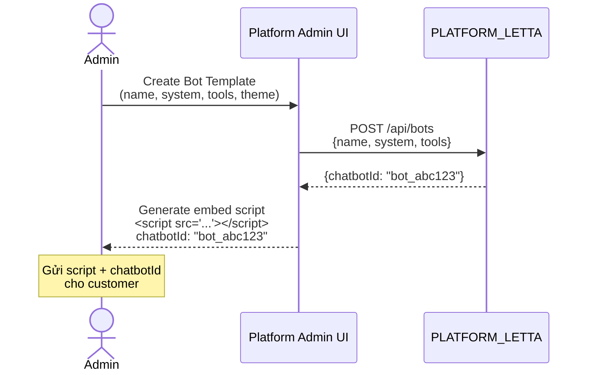
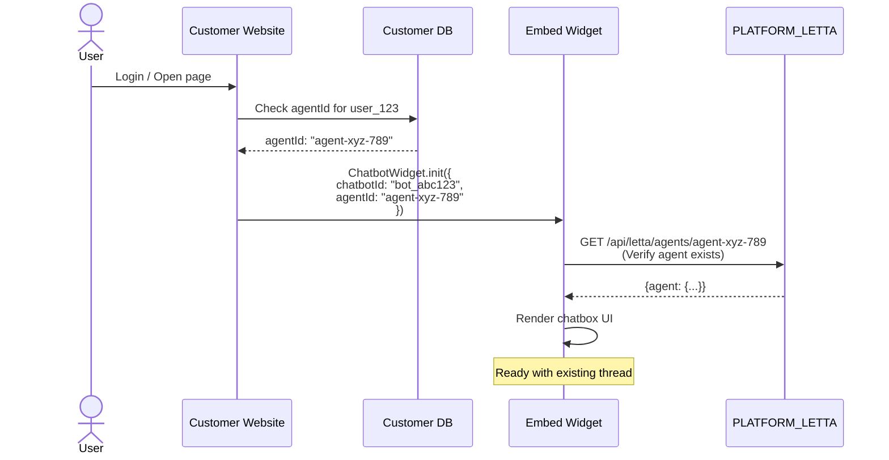
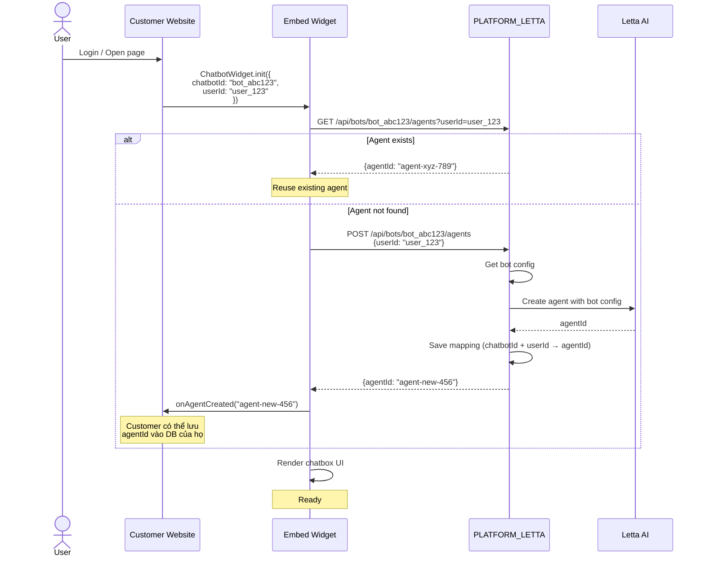
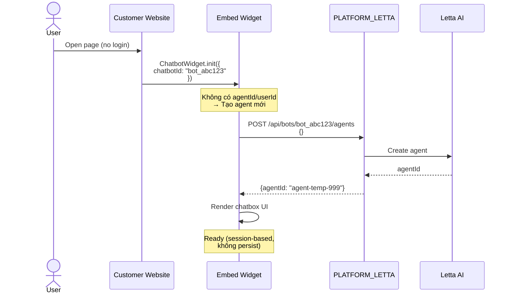
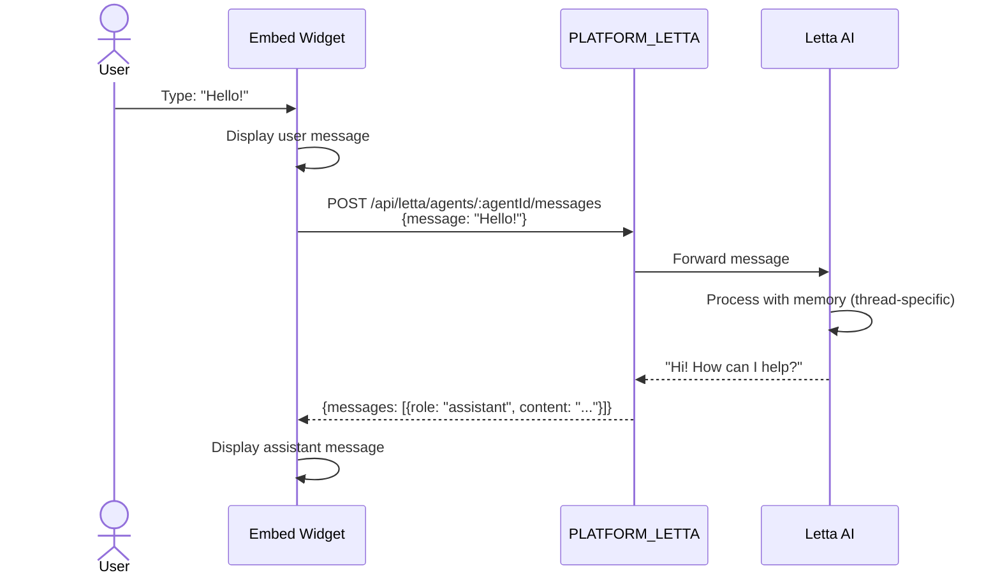
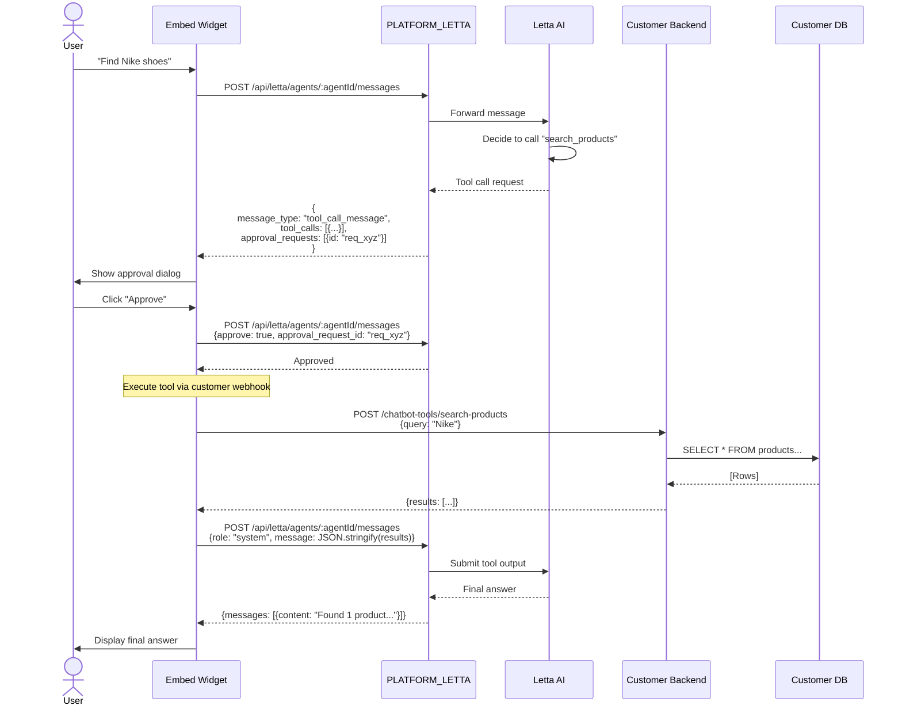
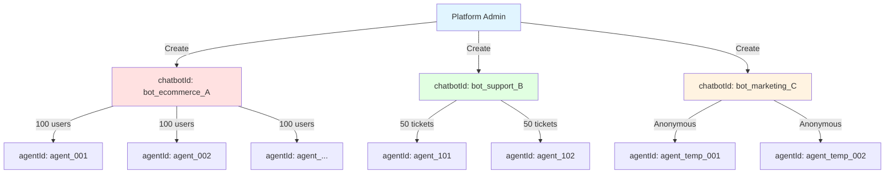
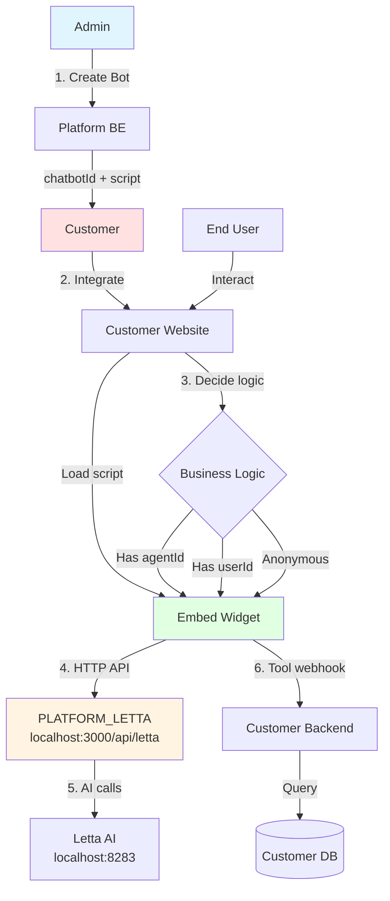

# Sequence Diagrams

## 1. Admin Setup (One-time)

---

## 2. Customer Integration - Option A (Customer quản lý agentId)

---

## 3. Customer Integration - Option B (Widget tự get/create agent)

---

## 4. Customer Integration - Option C (Anonymous user)

---

## 5. Chat Flow (Simple Text)

---

## 6. Tool Call Flow (HITL)

---

## 7. Multi-Project Architecture

**Giải thích**:
- 1 Platform phục vụ nhiều projects (chatbotIds).
- Mỗi chatbotId có config riêng (system prompt, tools).
- Mỗi chatbotId có nhiều agents (threads).
- Customer tự quyết định logic map user → agent.

---

## 8. Complete System Flow

---

Tiếp theo: [API Contract](./04-api-contract.md)
