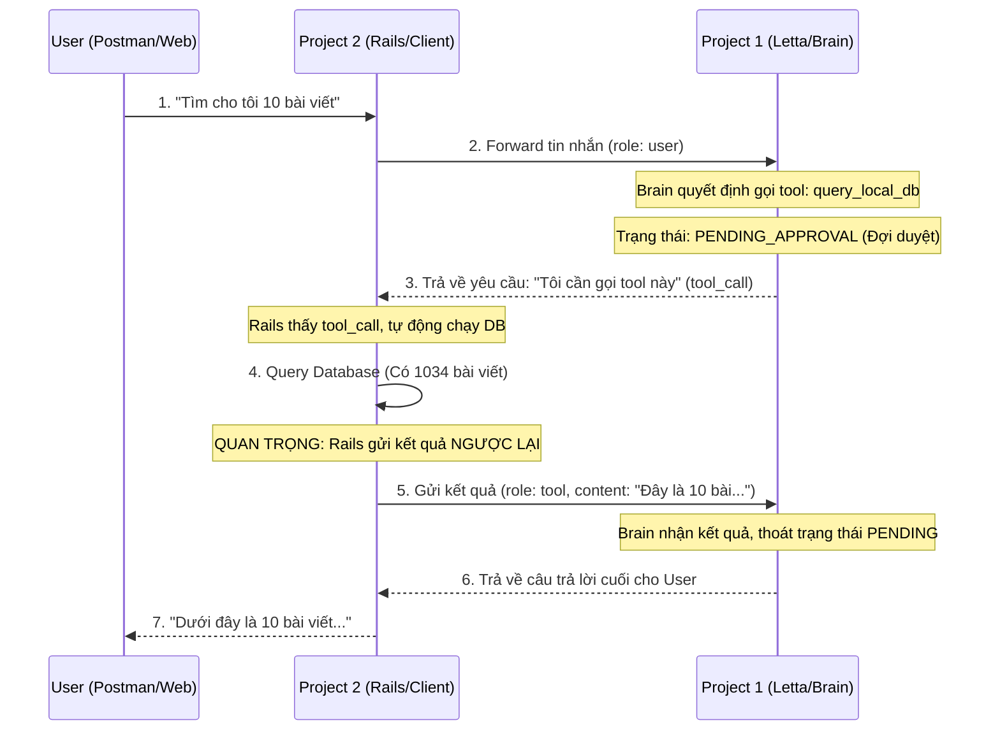

# Sequence Diagram: Quy trình Truy vấn Database

Để hiểu tại sao có lỗi `409`, boss hãy nhìn vào sơ đồ "3 bên" dưới đây:

---

## Giải thích lỗi 409 (PENDING_APPROVAL)

Khi boss gọi lệnh `curl` ở bước **1**, Letta Server đã gửi lại phản hồi ở bước **3** (yêu cầu gọi tool).

**Lỗi xảy ra khi:**
- Boss tiếp tục gửi lệnh `curl` (tin nhắn mới) trong khi Letta vẫn đang ở trạng thái **Đợi duyệt** (giữa bước 3 và 5).
- Letta Server nói: *"Tôi đang đợi boss gửi kết quả database (bước 5), đừng gửi yêu cầu mới!"*

## Cách khắc phục:
1. Team Rails phải đọc JSON ở bước **3**.
2. Lấy cái `tool_call_id`.
3. Gửi một request `POST` với `role: tool` (Bước **5**) để "giải cứu" Letta khỏi trạng thái đợi.

Chi tiết cách gửi Bước 5: [Phase 4: Submit Tool Result](./04-send-response.md)
