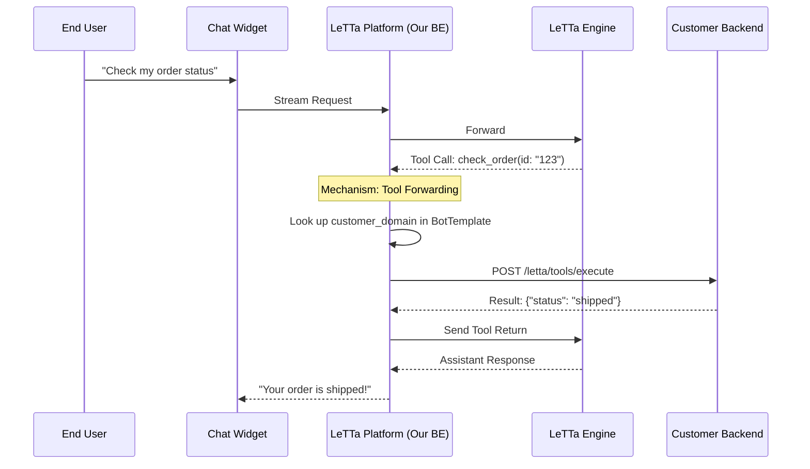

# Tool Approval - Overview

**Feature**: User Approval Workflow & Bidirectional Tool Forwarding
**Status**: 🔴 Not Started
**Parent**: [../00-implementation-plan.md](../00-implementation-plan.md)

---

## 1. Overview

Implement a secure workflow where Letta agents must request user approval before executing sensitive tools. Additionally, implement the **Bidirectional Forwarding** mechanism to allow the platform to request tool execution from a customer's private backend using a registered domain.

---

## 2. Business Goals

1. **Security**: Prevent unauthorized tool executions.
2. **Transparency**: Users see exactly what the agent wants to do.
3. **Connectivity**: Enable "RAG" and tool execution on private customer data.
4. **Audit Trail**: Track all approval decisions.

---

## 3. Technical Goals & Mechanism

### A. Human-in-the-Loop (HITL) Detection
- Intercept `approval_request_message` in the Letta stream.
- Halt current stream and notify the Chat Widget.

### B. Bidirectional Forwarding (The "Domain" Requirement)
To allow the Agent (running in our platform) to execute logic on the Customer's Backend (private infrastructure), we use the `customer_domain` registered in the Bot Template.

**Logic Flow**:
1. Agent decides a tool (e.g., `check_order`) is needed.
2. Platform detects this is an **External Tool**.
3. Platform fetches `customer_domain` from `BotTemplate`.
4. Platform forwards the call: `POST https://{customer_domain}/letta/tools/execute`.
5. Customer Backend returns result -> Platform forwards back to Letta Engine.

---

## 4. Sequence Diagram (The Full Cycle)

---

## 5. Acceptance Criteria

- [ ] Detects `approval_request_message` in stream.
- [ ] Correcty look up and use `customer_domain` for routing.
- [ ] Forwarding request includes HMAC signature for security.
- [ ] Captures new `run_id` upon approval and resumes stream.
- [ ] Multi-org isolation is strictly enforced.
