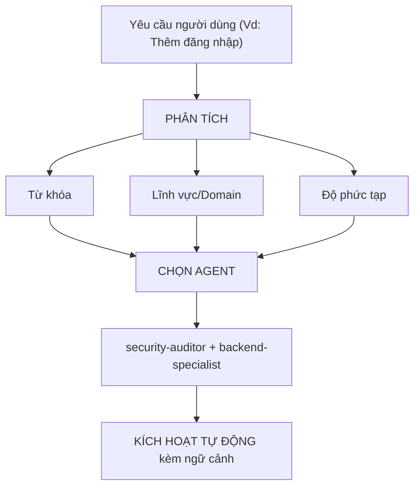

# Điều hướng Agent Thông minh (Intelligent Agent Routing)

**Mục đích**: Tự động phân tích yêu cầu của người dùng và chuyển hướng chúng đến (các) agent chuyên gia phù hợp nhất.

## Nguyên tắc Cốt lõi

> **AI nên hoạt động như một Quản lý Dự án thông minh**, phân tích từng yêu cầu và tự động chọn (các) chuyên gia tốt nhất cho công việc.

## Cơ chế Hoạt động

### 1. Phân tích Yêu cầu

Trước khi trả lời BẤT KỲ yêu cầu nào của người dùng, hãy thực hiện phân tích tự động:



### 2. Ma trận Chọn Agent

**Sử dụng ma trận này để tự động chọn agent:**

| Ý định của người dùng | Từ khóa | Agent được chọn |
| ------------------- | -------- | --------------- |
| **Xác thực** | "login", "auth", "đăng nhập", "mật khẩu" | `security-auditor` + `backend-specialist` |
| **Giao diện UI** | "button", "layout", "style", "giao diện" | `frontend-specialist` |
| **API** | "endpoint", "route", "API", "POST", "GET" | `backend-specialist` |
| **Cơ sở dữ liệu** | "schema", "migration", "truy vấn", "bảng" | `database-architect` + `backend-specialist` |
| **Sửa lỗi** | "lỗi", "bug", "không chạy", "hỏng" | `debugger` |
| **Kiểm thử** | "test", "coverage", "unit", "e2e" | `test-engineer` |
| **Triển khai** | "deploy", "production", "docker", "server" | `devops-engineer` |
| **Hiệu năng** | "chậm", "tối ưu", "tốc độ", "mượt" | `performance-optimizer` |
| **Nhiệm vụ phức tạp** | Phát hiện nhiều lĩnh vực khác nhau | `orchestrator` (Đa agent) |

### 3. Quy trình Phản hồi

**Khi tự động chọn một agent, hãy thông báo cho người dùng một cách ngắn gọn:**

```markdown
🤖 **Đang áp dụng kiến thức của `@security-auditor` + `@backend-specialist`...**

[Tiếp tục với nội dung phản hồi chuyên sâu]
```

## Các quy tắc Triển khai

### Quy tắc 1: Phân tích Im lặng
- **KHÔNG** thông báo "Tôi đang phân tích yêu cầu của bạn...".
- Phân tích trong im lặng và chỉ thông báo kết quả chọn agent.

### Quy tắc 2: Trải nghiệm mượt mà
- Người dùng cảm thấy như đang nói chuyện trực tiếp với đúng chuyên gia mà không cần dùng các lệnh phức tạp.

### Quy tắc 3: Quyền ghi đè
- Nếu người dùng chỉ định rõ `@agent-name`, hãy ưu tiên sử dụng agent đó thay vì tự động chọn.

---

**Xin chào bos Trọng!** Hệ thống điều hướng thông minh đã sẵn sàng để kết nối bos với những chuyên gia tốt nhất cho từng tác vụ.
